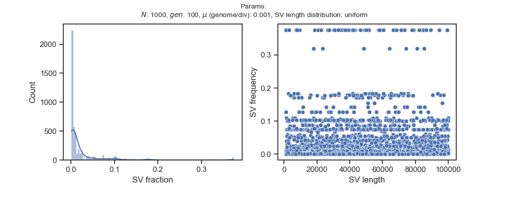

# SV

Basic structural variation simulations in C++. Python wrapper provided.

Currently extremely minimal features and only neutral evolution.

### Example

```python
from sv import Simulator

params = {
    'population_size': 1000,
    'generations': 100,
    'mutation_rate': 0.001,
    'sv_length_distribution': 'uniform'
}

simulator = Simulator(params)

simulator.run()
simulator.plot()
mutation_ids, sv_lengths, frequency = simulator.data()
```

A plot of the SV fraction and length distribution. Note that the SV length distribution should match the parameter `sv_length_distribution`.

</img>